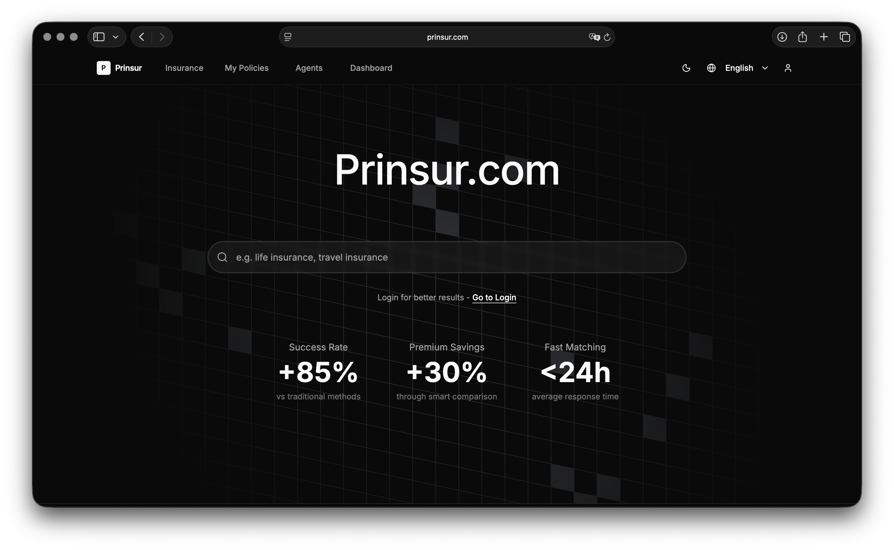

# Prinsur - 智慧保險媒合平台



一個透明、高效且以使用者為中心的保險生態系統，透過線上比價、線下媒合 (O2O) 的模式，打破資訊不對稱，建立透明的保險決策環境。

## 特色功能

### **智慧比價系統**

- 透明的保險商品比價，讓您輕鬆找到最適合的保險方案
- **多維度排序**：支援 9 種排序方式（保費、保障額度、評分、熱門度等）
- **智慧篩選**：可折疊式篩選器，支援保險類型、年齡、保費範圍等條件
- **用戶偏好記憶**：使用 localStorage 記住排序偏好

### **精準媒合**

- 根據地理位置和需求，精準媒合合適的保險業務專員
- **多條件篩選**：專業領域、評分、年資、語言能力
- **地理位置優先**：智慧地理位置排序演算法

### **保單管理**

- **消費者端**：完整的個人保單管理系統，自動提醒繳費和到期時間
- **業務員端**：客戶保單管理、業績追蹤、報表分析
- **統計儀表板**：2x2 響應式統計卡片設計

### **個人資料管理**

- **BMI 健康狀態標籤**：自動計算並顯示健康狀態（過輕、正常、過重等）
- **完整資料欄位**：年齡、體重、身高、性別、職業等級、醫療史

### **多語言支援**

- 支援繁體中文與英文雙語切換
- 完整的介面翻譯，包含所有功能模組

### **響應式設計**

- 完美適配桌面端與移動端設備
- **移動端優化**：16px 最小字體確保無瀏覽器縮放問題
- **彈性佈局**：自適應標題區域和操作按鈕排版

## 技術架構

- **框架**: Next.js 15 (App Router)
- **語言**: TypeScript (strict mode)
- **樣式**: Tailwind CSS + Shadcn/ui
- **國際化**: next-intl
- **圖示**: Lucide React + React Icons
- **主題**: next-themes 明暗主題切換
- **3D 特效**: Three.js + OGL

## 專案結構

```
src/
├── app/
│   ├── [locale]/                 # 國際化路由 (zh-TW, en)
│   │   ├── page.tsx              # 首頁 - Hero + 統計數據 + 功能介紹
│   │   ├── public/               # 公開頁面模組
│   │   │   ├── agents/           # 業務員搜尋 (60+ 業務員) - 未登入+消費者可用
│   │   │   └── products/         # 保險商品比較 (120+ 商品) - 未登入+消費者可用
│   │   ├── app/                  # 消費者認證模組
│   │   │   ├── profile/          # 消費者個人資料設定
│   │   │   └── insurance/        # 其他消費者功能
│   │   ├── workspace/            # 業務員認證模組
│   │   │   ├── dashboard/        # 業務員工作台
│   │   │   ├── clients/          # 客戶管理
│   │   │   ├── policies/         # 保單管理
│   │   │   ├── reports/          # 業績報表
│   │   │   └── profile/          # 業務員資料
│   │   ├── auth/                 # 認證模組
│   │   │   ├── login/            # 登入頁面
│   │   │   └── register/         # 註冊頁面
│   │   ├── icon.png              # App 圖示 (PWA)
│   │   ├── icon.svg              # App 圖示 (SVG)
│   │   └── layout.tsx            # 根佈局
│   └── globals.css               # 全域樣式
├── components/
│   ├── auth/                     # 認證相關組件
│   ├── layout/                   # 佈局組件
│   │   ├── header.tsx            # 響應式導航頁首
│   │   └── footer.tsx            # 頁尾
│   ├── providers/                # Context Providers
│   │   ├── theme-provider.tsx    # 主題管理
│   │   └── loading-provider.tsx  # 載入狀態
│   └── ui/                       # Shadcn/ui 組件庫
├── contexts/
│   └── auth-context.tsx          # 認證狀態管理
├── data/                         # 模擬資料
│   ├── mock-insurance.ts         # 120+ 保險商品
│   ├── mock-agents.ts            # 60+ 業務員資料
│   └── mock-companies.ts         # 18 家保險公司
├── hooks/
│   └── use-reveal-animation.ts   # 動畫效果鉤子
├── i18n/
│   └── config.ts                 # 國際化配置
├── lib/
│   └── utils.ts                  # 工具函數 + CN 類名合併
├── types/                        # TypeScript 類型定義
│   ├── insurance.ts              # 保險相關類型
│   └── agent.ts                  # 業務員相關類型
├── utils/                        # 業務邏輯工具
│   ├── premium-calculator.ts     # 保費計算器
│   └── recommendations.ts        # 排序和推薦演算法
└── messages/                     # 國際化翻譯檔
    ├── en.json                   # 英文翻譯
    └── zh-TW.json                # 繁體中文翻譯
```

## 快速開始

### 環境需求

- Node.js 18.0 或更高版本
- npm 或 yarn

### 安裝與運行

1. **克隆專案**

```bash
git clone [repository-url]
cd prinsur-demo
```

2. **安裝依賴**

```bash
npm install
```

3. **啟動開發伺服器**

```bash
npm run dev
```

4. **瀏覽網站**
   開啟瀏覽器訪問 [http://localhost:3000](http://localhost:3000)

### 可用指令

```bash
npm run dev          # 啟動開發伺服器 (http://localhost:3000)
npm run build        # 建構生產版本
npm run start        # 啟動生產伺服器
npm run lint         # 執行 ESLint 檢查
npm run typecheck    # 執行 TypeScript 類型檢查
npm run format       # 使用 Prettier 格式化代碼
npm run format:check # 檢查代碼格式
```

## 頁面功能詳解

### **首頁 (`/`)**

- **Hero 區塊**：品牌價值主張展示，包含打字動畫效果
- **搜尋功能**：全站保險商品搜尋
- **統計數據**：3個關鍵指標展示 (+85% 成交率、+30% 保費節省、<24h 快速媒合)
- **核心功能介紹**：智慧比價、精準媒合、保單管理
- **響應式設計**：網格背景特效 + 動畫

### **保險商品比較 (`/public/products`)**

- **120+ 保險商品**：涵蓋壽險、醫療險、意外險、旅遊險、車險、財產險
- **公開訪問**：未登入用戶和消費者均可使用
- **智慧篩選系統**：
  - 可折疊式篩選器 ("展開篩選" / "隱藏篩選")
  - 保險類型、年齡、保費範圍篩選
  - 9種排序方式：預設、保費升降、保障額度、評分、熱門度、最新上市、公司名稱
- **用戶偏好記憶**：localStorage 儲存排序設定
- **商品詳情**：完整商品資訊與比較功能

### **業務員搜尋 (`/public/agents`)**

- **60+ 業務員資料**：分布全台各地區
- **公開訪問**：未登入用戶和消費者均可使用
- **多維度篩選**：
  - 專業領域（壽險、醫療險等）
  - 最低評分、最低年資
  - 語言能力（中文、英文、日文、台語、客家話）
  - 可折疊式篩選器
- **智慧排序**：地理位置優先、評分、年資等
- **聯絡功能**：評分與評價系統、聯絡資訊

### **消費者保單管理 (`/consumer/policies`)**

- **2x2 統計儀表板**：生效保單、保費支出、即將到期、理賠紀錄
- **保單列表**：完整保單資訊展示
- **提醒系統**：自動保費和到期提醒
- **狀態追蹤**：保單狀態實時更新

### **消費者個人資料 (`/app/profile`)**

- **認證訪問**：僅消費者登入後可用
- **基本資料**：姓名、年齡、性別、聯絡方式
- **健康資訊**：身高、體重、BMI 自動計算
- **BMI 健康標籤**：過輕、正常、過重、肥胖狀態顯示
- **職業資訊**：職業等級選擇
- **醫療史**：既往病史記錄

### **業務員工作台 (`/workspace/dashboard`)**

- **認證訪問**：僅業務員登入後可用
- **2x2 統計儀表板**：客戶數、保單數、月收入、待處理事項
- **快速操作**：新增客戶、查看保單、業績分析
- **近期活動**：最新客戶互動和保單狀態

### **客戶管理 (`/workspace/clients`)**

- **認證訪問**：僅業務員登入後可用
- **客戶列表**：完整客戶資訊管理
- **搜尋功能**：快速客戶查找
- **客戶統計**：總客戶數、總保單數、新增客戶
- **響應式佈局**：標題與操作按鈕彈性排列

### **保單管理 (`/workspace/policies`)**

- **認證訪問**：僅業務員登入後可用
- **保單總覽**：所有客戶保單統一管理
- **狀態分類**：有效、待處理、已到期分頁
- **統計面板**：總保單數、有效保單、月保費收入、待審核
- **搜尋篩選**：快速保單查找

### **業績報表 (`/workspace/reports`)**

- **認證訪問**：僅業務員登入後可用
- **時期選擇**：本月、本季、本年業績分析
- **關鍵指標**：總營收、新客戶、成交保單、達成率
- **視覺化圖表**：業績趨勢和達成率分析
- **響應式設計**：期間選擇器彈性佈局

### **業務員個人資料 (`/workspace/profile`)**

- **認證訪問**：僅業務員登入後可用
- **專業資料**：業務員認證、專業領域、年資
- **聯絡資訊**：辦公地址、服務區域、語言能力
- **業績統計**：歷史業績、客戶評價、認證狀況

### **認證系統 (`/auth/*`)**

- **登入頁面 (`/auth/login`)**：支援消費者和業務員雙重登入
- **註冊頁面 (`/auth/register`)**：分別處理消費者和業務員註冊
- **統一認證流程**：集中管理所有認證相關功能

## 路由架構

### **路由設計原則**

本專案採用功能導向的路由架構，根據用戶類型和頁面訪問權限進行組織：

#### **公開路由 (`/public/*`)**
- **無需認證**：未登入用戶可直接訪問
- **消費者共用**：登入後的消費者也可使用
- **核心功能**：保險商品比較、業務員搜尋

#### **消費者專區 (`/app/*`)**
- **認證要求**：僅消費者登入後可訪問
- **個人化服務**：個人資料管理、保單記錄等

#### **業務員專區 (`/workspace/*`)**
- **認證要求**：僅業務員登入後可訪問
- **專業工具**：客戶管理、業績報表、工作台

#### **認證模組 (`/auth/*`)**
- **集中管理**：所有認證相關功能
- **統一入口**：登入、註冊、密碼重設等

### **路由安全**

- **佈局級認證**：在路由佈局層級進行權限檢查
- **角色導向重定向**：自動導航到用戶對應的功能區域
- **路由守衛**：防止未授權訪問受保護頁面
- **狀態管理**：全域認證狀態同步

## 國際化

### 支援語言

- **繁體中文** (`zh-TW`) - 預設語言
- **英文** (`en`)

### 翻譯管理

- 語言檔案位於 `messages/` 目錄，使用 JSON 格式
- 完整的界面翻譯，包含所有功能模組
- 路由結構：`/[locale]/page` 支援多語言路徑

## 設計系統

### **主題色彩**

- **明暗主題自動切換**：基於系統偏好設定
- **品牌logo適配**：自動主題色反轉 (`dark:invert`)
- **CSS 變數管理**：一致的顏色系統

### **響應式斷點**

- `sm`: 640px+ (小型設備)
- `md`: 768px+ (平板)
- `lg`: 1024px+ (筆記型電腦)
- `xl`: 1280px+ (桌面)
- `2xl`: 1536px+ (大螢幕)

### **字體系統**

- **主要字體**：Inter (Google Fonts)
- **中文字體**：系統預設字體堆疊
- **移動端最佳化**：最小 16px 字體避免瀏覽器縮放
- **標題統一**：`text-3xl font-bold tracking-tight` 跨頁面一致性

### **UI 組件設計原則**

- **可折疊式介面**：篩選器支援展開/隱藏
- **2x2 統計佈局**：移動端友好的網格設計
- **彈性排版**：標題與操作按鈕自適應佈局
- **固定定位header**：滾動時保持導航可見

## 模擬資料

### 豐富的測試資料

- **保險商品**: 120+ 筆，涵蓋 6 大保險類型
- **保險公司**: 18 家主要保險公司完整品牌資訊
- **業務員**: 60+ 位，分布全台各地區，多語言能力
- **評分系統**: 3.5-5.0 星評分機制，真實評價內容
- **保費數據**: 符合市場價格的保費計算
- **時間數據**: 完整的日期和提醒系統

## 開發工具鏈

### **代碼品質**

- **ESLint**: Next.js 核心規則擴展
- **Prettier**: 統一代碼格式化
- **TypeScript**: Strict mode 類型檢查
- **Git hooks**: 預提交代碼檢查

### **開發體驗**

- **路徑別名**: `@/` 指向 src 目錄
- **組件庫**: Shadcn/ui + class-variance-authority
- **圖標系統**: Lucide React + React Icons
- **動畫系統**: 自訂 reveal 動畫鉤子

## 效能優化

### **前端效能**

- **Next.js Image**: 自動圖片優化和懶加載
- **Google Fonts**: 字體預載和優化
- **代碼分割**: 路由級和組件級動態導入
- **快取策略**: 適當的 Cache-Control 頭設定

### **用戶體驗**

- **SSR/SSG**: 伺服器端渲染首屏優化
- **Hydration 一致性**: 防止 SSR/CSR 不一致問題
- **載入狀態**: 全域載入狀態管理
- **LocalStorage**: 用戶偏好本地持久化

### **移動端優化**

- **16px 最小字體**: 防止 iOS Safari 自動縮放
- **觸控友好**: 適當的點擊目標大小
- **固定 header**: 移動端瀏覽器兼容性
- **彈性佈局**: 響應式組件設計

## 部署

### 推薦平台

- **Vercel** (推薦) - Next.js 原生支援，零配置部署
- **Netlify** - 靜態站點部署
- **任何支援 Node.js 的雲端平台**

### 部署配置

```bash
# 建構生產版本
npm run build

# 啟動生產伺服器
npm run start
```

### 環境變數

目前專案使用模擬資料，無需額外環境變數配置。

## 🔧 技術特色

### **現代化開發實踐**

- Next.js 15 App Router 最新特性
- TypeScript Strict Mode 類型安全
- ESLint + Prettier 代碼規範
- Responsive Design 響應式設計
- Progressive Web App 支援

### **用戶體驗優化**

- 服務端渲染 (SSR) 首屏快速載入
- 客戶端導航流暢切換
- 動畫效果提升互動體驗
- 無障礙設計 (Accessibility)
- 搜尋引擎優化 (SEO)

### **開發效率提升**

- 熱重載開發體驗
- TypeScript 智能提示
- 組件庫快速開發
- 路徑別名簡化導入
- Git 工作流程整合

## 未來規劃

### **第一階段 (已完成)**

- [x] 基礎架構搭建
- [x] 核心頁面開發
- [x] 響應式設計
- [x] 國際化支援
- [x] 基本功能實現

### **第二階段 (規劃中)**

- [ ] 後端 API 整合
- [ ] 用戶認證系統
- [ ] 即時通訊功能
- [ ] 支付系統整合
- [ ] 進階數據分析

### **第三階段 (未來)**

- [ ] AI 智能推薦
- [ ] 微服務架構
- [ ] 移動端 App
- [ ] 區塊鏈整合
- [ ] 大數據分析

## 授權

本專案僅供展示和學習用途。

## 貢獻

歡迎提交 Issues 和 Pull Requests 來改善專案：

1. Fork 此專案
2. 建立你的功能分支 (`git checkout -b feature/AmazingFeature`)
3. 提交你的改動 (`git commit -m 'Add some AmazingFeature'`)
4. 推送到分支 (`git push origin feature/AmazingFeature`)
5. 開啟 Pull Request

## 聯絡

如有任何問題或建議，歡迎：

- 提交 GitHub Issues
- 發起 Pull Request
- 聯絡專案維護者

---

**Made by Prinsur team Taiwan**
