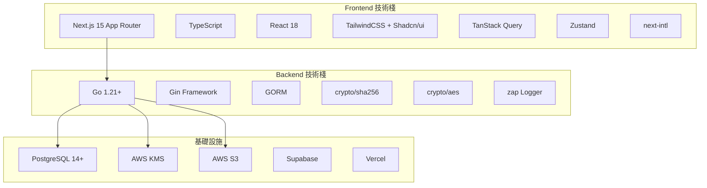
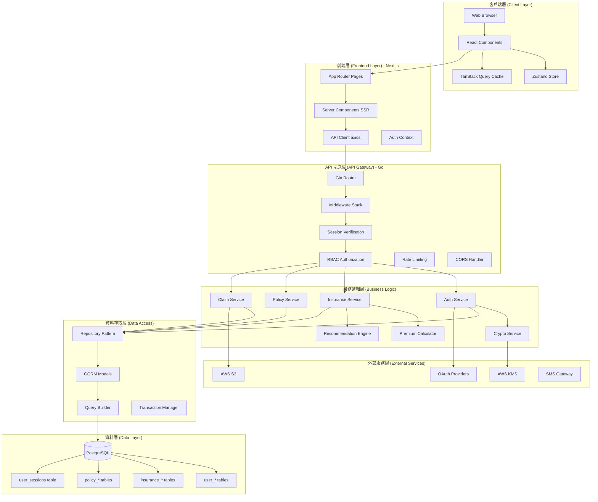
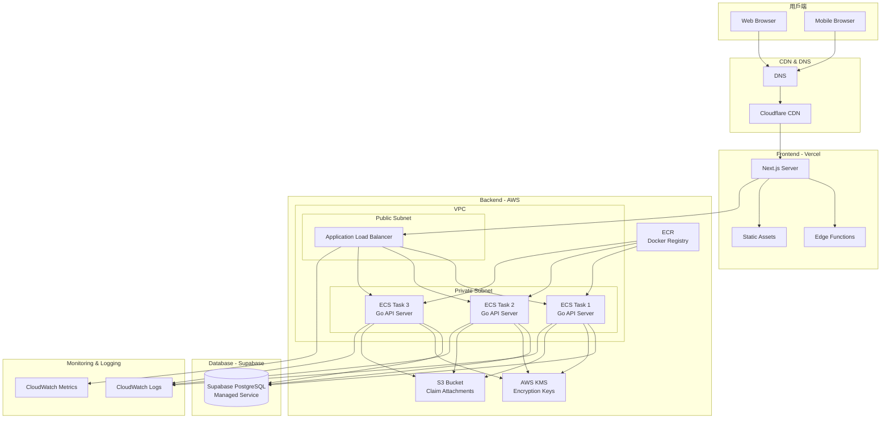
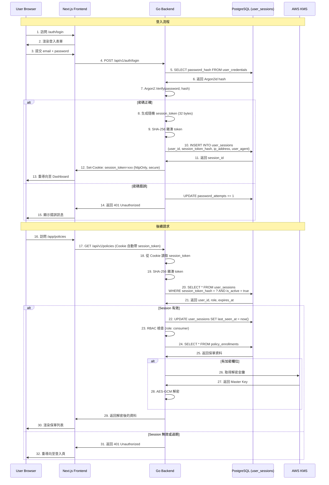
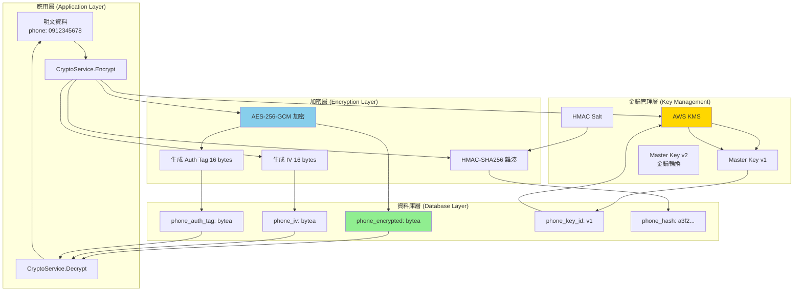
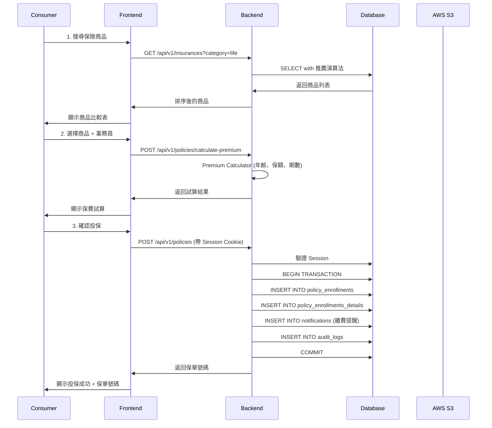
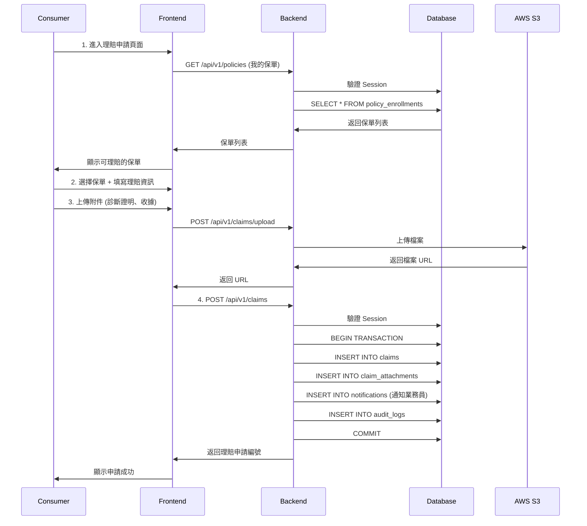
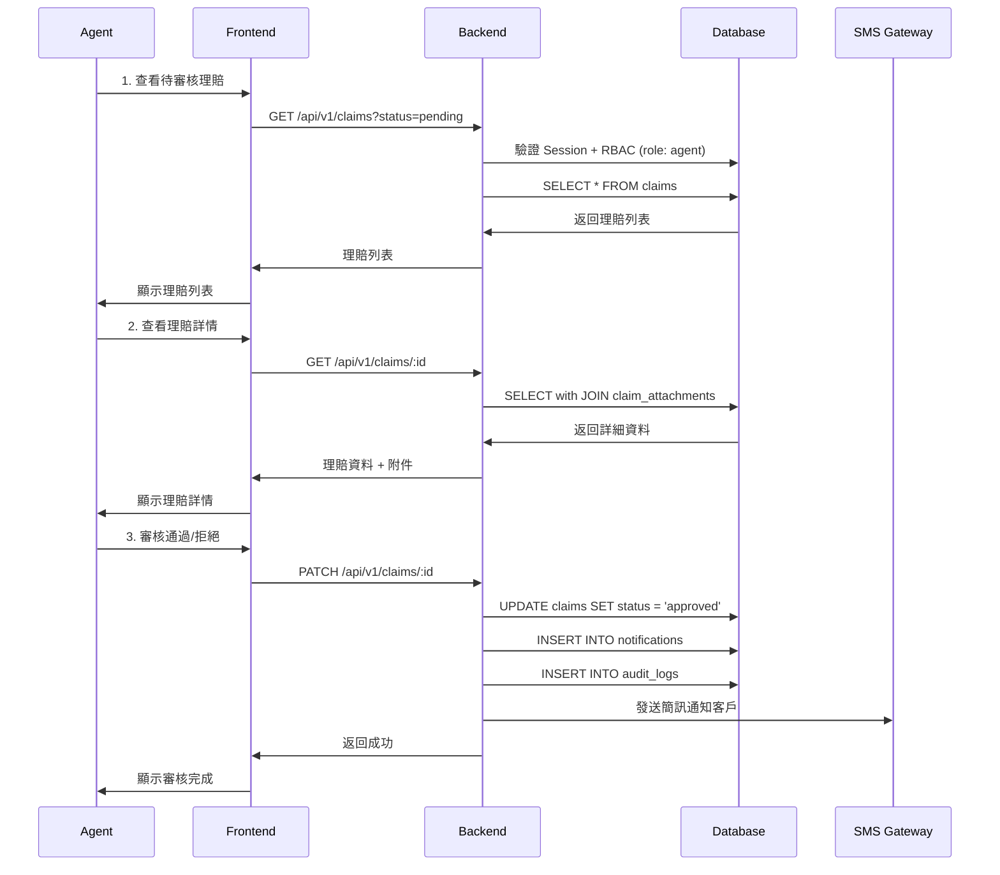
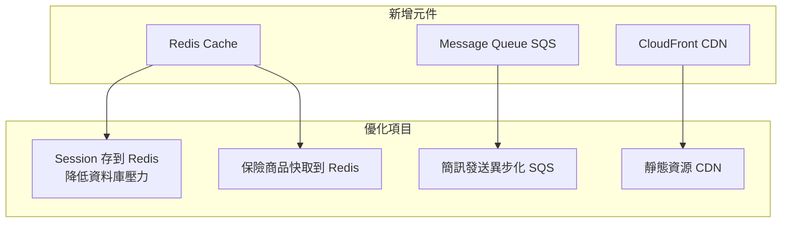
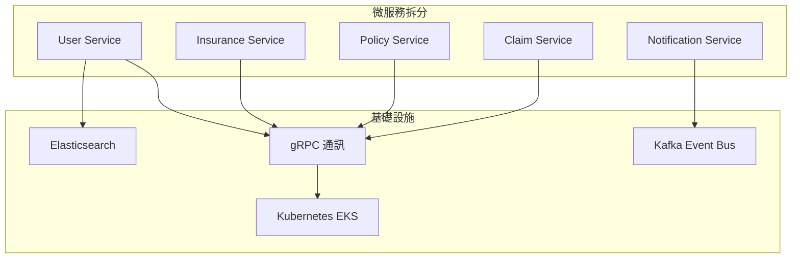

# Prinsur 系統架構文件

> **版本**: v1.2
> **日期**: 2025-10-04
> **架構師**: CTO
> **狀態**: MVP 階段設計（採用 Supabase 降低成本）

---

## 目錄

1. [系統概述](#系統概述)
2. [技術棧總覽](#技術棧總覽)
3. [系統分層架構](#系統分層架構)
4. [部署架構](#部署架構)
5. [認證與授權架構](#認證與授權架構)
6. [資料加密架構](#資料加密架構)
7. [專案結構](#專案結構)
8. [核心業務流程](#核心業務流程)
9. [擴展性規劃](#擴展性規劃)

---

## 系統概述

Prinsur 是一個智慧保險媒合平台，採用 O2O (Online-to-Offline) 模式，提供：

- 📊 **保險商品比價**：多家保險公司商品比較
- 👤 **業務員媒合**：智慧推薦系統匹配合適業務員
- 📋 **保單管理**：線上投保與保單生命週期管理
- 💰 **理賠服務**：理賠申請與追蹤

### 核心設計原則

1. **安全優先**：符合 ISO 27001 標準（85% 合規）
2. **前後端分離**：職責清晰，便於擴展
3. **型別安全**：Go 強型別 + TypeScript
4. **資料加密**：敏感資料 AES-256-GCM 加密
5. **可審計性**：完整的 Session 追蹤與審計日誌

---

## 技術棧總覽



### 詳細技術棧

| 層級         | 技術                       | 用途                | 版本   |
| ------------ | -------------------------- | ------------------- | ------ |
| **Frontend** | Next.js                    | SSR/SSG 框架        | 15.x   |
|              | TypeScript                 | 型別安全            | 5.x    |
|              | TanStack Query             | 資料獲取與快取      | 5.x    |
|              | Zustand                    | 狀態管理            | 4.x    |
|              | Shadcn/ui                  | UI 組件庫           | Latest |
|              | next-intl                  | 國際化 (zh-TW, en)  | 3.x    |
| **Backend**  | Go                         | 高效能 API 服務     | 1.21+  |
|              | Gin                        | HTTP 框架           | 1.9+   |
|              | GORM                       | ORM                 | 1.25+  |
|              | crypto/sha256              | Session Token 雜湊  | stdlib |
|              | golang.org/x/crypto/argon2 | 密碼加密            | Latest |
|              | viper                      | 配置管理            | 1.18+  |
|              | zap                        | 結構化日誌          | 1.27+  |
| **Database** | PostgreSQL                 | 主資料庫            | 14+    |
|              | Supabase                   | PostgreSQL 托管服務 | -      |
| **部署**     | Vercel                     | Frontend 部署       | -      |
|              | AWS ECS                    | Backend 容器化部署  | -      |
|              | AWS KMS                    | 金鑰管理            | -      |
|              | AWS S3                     | 檔案儲存            | -      |

---

## 系統分層架構



### 各層職責說明

#### 1. 客戶端層 (Client Layer)

- **React Components**: UI 渲染與用戶互動
- **Zustand Store**: 全域狀態管理（用戶資訊、購物車）
- **TanStack Query**: 伺服器狀態快取與同步

#### 2. 前端層 (Frontend Layer)

- **App Router**: 基於檔案的路由系統
- **Server Components**: SSR 渲染保險商品、業務員列表
- **API Client**: 統一的 HTTP 請求層，自動攜帶 Session Cookie

#### 3. API 閘道層 (API Gateway)

- **Gin Router**: HTTP 路由處理
- **Middleware Stack**:
  - Session 驗證（查詢 user_sessions 表）
  - RBAC 權限檢查
  - 請求速率限制
  - CORS 設定
  - 審計日誌

#### 4. 業務邏輯層 (Business Logic)

- **Auth Service**: 登入、註冊、密碼重置、Session 管理
- **Insurance Service**: 保險商品 CRUD、推薦演算法
- **Policy Service**: 保單投保、續保、查詢
- **Claim Service**: 理賠申請、審核、附件管理
- **Crypto Service**: AES-256-GCM 加密/解密
- **Premium Calculator**: 保費計算引擎（策略模式）

#### 5. 資料存取層 (Data Access)

- **Repository Pattern**: 抽象資料存取邏輯
- **GORM Models**: ORM 模型定義
- **Transaction Manager**: 事務管理

#### 6. 資料層 (Data Layer)

- **PostgreSQL**: 主資料庫（詳見 ERD）
- 30+ 張表，包含用戶、保險、保單、理賠模組
- **user_sessions**: Session 管理專用表（支援多裝置登入、強制登出）

#### 7. 外部服務層 (External Services)

- **AWS KMS**: 主加密金鑰管理
- **AWS S3**: 理賠附件儲存
- **OAuth Providers**: Google/Facebook 登入
- **SMS Gateway**: 繳費提醒簡訊

---

## 部署架構



### 部署環境規格

#### Frontend (Vercel)

```
Platform: Vercel
Region: Tokyo (ap-northeast-1)
CDN: Vercel Edge Network
Domain: prinsur.com
SSL: Auto-managed (Let's Encrypt)
```

#### Backend (AWS ECS)

```
Service: ECS Fargate
Region: ap-northeast-1 (Tokyo)
vCPU: 0.5 vCPU per task
Memory: 1 GB per task
Tasks: 3 (Auto-scaling 2-10)
Load Balancer: Application Load Balancer
Health Check: /api/v1/health
```

#### Database (Supabase)

```
Engine: PostgreSQL 14+
Plan: Free Tier (MVP 階段)
Storage: 500 MB (可升級)
Connection Pooling: PgBouncer (內建)
Backup: 自動備份 (包含在服務中)
Encryption: AES-256 (at rest)
Connection: Direct connection (無需 VPC Peering)
Region: ap-southeast-1 (Singapore, 最接近台灣)

連線字串:
host=db.xxxxxxxxxxxxxx.supabase.co
port=5432
dbname=postgres
user=postgres
password=<your_password>
sslmode=require
```

**優勢**:

- ✅ 免費方案適合 MVP（500MB DB + 1GB Storage + 50k MAU）
- ✅ 無需管理 VPC 網路（直接 TLS 連線）
- ✅ 內建連線池（PgBouncer）
- ✅ 可隨時升級至付費方案或遷移至 AWS RDS
- ✅ 與 GORM 完全相容（相同的 PostgreSQL 協議）

#### 網路架構

```
VPC CIDR: 10.0.0.0/16
Public Subnet: 10.0.1.0/24, 10.0.2.0/24
Private Subnet: 10.0.10.0/24, 10.0.11.0/24
NAT Gateway: Yes (for private subnet egress + Supabase connection)

註: Supabase 無需 Database Subnet，直接透過 NAT Gateway 連線
```

---

## 認證與授權架構

### Session-Based 認證機制

本系統採用 **Session-Based 認證**，而非無狀態的 JWT，主要原因：

1. ✅ **可主動撤銷 Session**（強制登出）
2. ✅ **完整審計追蹤**（記錄 IP、裝置、最後活動時間）
3. ✅ **多裝置管理**（查看所有活躍 Session）
4. ✅ **符合 ISO 27001**（金融業安全要求）。ㄡ

### 認證流程



### Session 資料結構 (user_sessions 表)

```sql
Table user_sessions {
    id                 int         [pk]
    user_id            int         [not null]
    session_token_hash varchar(64) [not null, unique]  -- SHA-256(session_token)
    expires_at         timestamptz [not null]          -- 過期時間
    ip_address         inet                            -- 登入 IP
    user_agent         text                            -- 瀏覽器資訊
    is_active          boolean     [default: true]     -- 是否活躍（可強制登出）
    created_at         timestamptz [default: now()]    -- 登入時間
    last_seen_at       timestamptz [default: now()]    -- 最後活動時間
    terminated_at      timestamptz                     -- 登出時間
}
```

### Session 管理功能

#### 1. 查看活躍裝置

```
GET /api/v1/auth/sessions

Response:
{
  "sessions": [
    {
      "id": 123,
      "device": "Chrome on macOS",
      "ip_address": "203.0.113.42",
      "last_seen_at": "2025-10-04T10:30:00Z",
      "is_current": true
    },
    {
      "id": 124,
      "device": "Safari on iPhone",
      "ip_address": "203.0.113.89",
      "last_seen_at": "2025-10-03T15:20:00Z",
      "is_current": false
    }
  ]
}
```

#### 2. 強制登出特定裝置

```
DELETE /api/v1/auth/sessions/:id

→ UPDATE user_sessions
  SET is_active = false, terminated_at = now()
  WHERE id = :id
```

#### 3. 登出所有裝置

```
POST /api/v1/auth/logout-all

→ UPDATE user_sessions
  SET is_active = false, terminated_at = now()
  WHERE user_id = :current_user_id AND is_active = true
```

### Session 生命週期

```
1. 登入 → 生成 session_token (64 字元隨機字串)
2. 雜湊 → SHA-256(session_token) 存入資料庫
3. 回傳 → session_token 存入 httpOnly Cookie
4. 驗證 → 每次請求查詢 user_sessions 表
5. 更新 → 更新 last_seen_at（追蹤活動）
6. 登出 → is_active = false（可撤銷）
7. 過期 → expires_at < now()（自動失效）
```

### RBAC 權限矩陣

| 功能             | consumer | agent | manager | admin |
| ---------------- | -------- | ----- | ------- | ----- |
| 查看保險商品     | ✅       | ✅    | ✅      | ✅    |
| 投保             | ✅       | ❌    | ❌      | ❌    |
| 查看自己的保單   | ✅       | ✅    | ✅      | ✅    |
| 查看客戶保單     | ❌       | ✅    | ✅      | ✅    |
| 申請理賠         | ✅       | ❌    | ❌      | ❌    |
| 審核理賠         | ❌       | ✅    | ✅      | ✅    |
| 管理保險商品     | ❌       | ❌    | ✅      | ✅    |
| 管理用戶         | ❌       | ❌    | ❌      | ✅    |
| 查看活躍 Session | ✅       | ✅    | ✅      | ✅    |
| 強制登出         | ❌       | ❌    | ❌      | ✅    |

---

## 資料加密架構



### 加密演算法應用

| 資料類型          | 演算法      | 用途         | 可逆      |
| ----------------- | ----------- | ------------ | --------- |
| **密碼**          | Argon2id    | 用戶密碼儲存 | ❌ 不可逆 |
| **Session Token** | SHA-256     | Session 識別 | ❌ 不可逆 |
| **電話號碼**      | AES-256-GCM | 加密儲存     | ✅ 可解密 |
| **病史資料**      | AES-256-GCM | 加密儲存     | ✅ 可解密 |
| **搜尋雜湊**      | HMAC-SHA256 | 快速查詢     | ❌ 不可逆 |

### 加密流程範例

#### 儲存電話號碼

```
輸入: "0912345678"
↓
1. AES-256-GCM 加密
   - 輸入: "0912345678"
   - Master Key: 從 KMS 取得
   - IV: 隨機生成 16 bytes
   - 輸出: encrypted_data + auth_tag
↓
2. HMAC-SHA256 雜湊
   - 輸入: "0912345678"
   - Salt: 從環境變數取得
   - 輸出: hash (用於搜尋)
↓
3. 寫入資料庫
   - phone_encrypted: encrypted_data
   - phone_iv: IV
   - phone_auth_tag: auth_tag
   - phone_key_id: "v1"
   - phone_hash: hash
```

#### 查詢電話號碼

```
輸入: "0912345678"
↓
1. 計算 HMAC-SHA256
   - hash = HMAC("0912345678", salt)
↓
2. 查詢資料庫
   - SELECT * WHERE phone_hash = hash
↓
3. 解密
   - 從 KMS 取得 Master Key (根據 phone_key_id)
   - AES-256-GCM 解密
   - 驗證 auth_tag
↓
輸出: "0912345678"
```

---

## 專案結構

### Monorepo 結構

```
prinsur-platform/
├── .git/
├── .github/
│   └── workflows/
│       ├── deploy-frontend.yml      # Frontend CI/CD
│       ├── deploy-backend.yml       # Backend CI/CD
│       └── test.yml                 # 測試流程
│
├── frontend/                        # Next.js Frontend
│   ├── src/
│   │   ├── app/
│   │   │   ├── [locale]/
│   │   │   │   ├── (public)/
│   │   │   │   │   ├── products/   # 保險商品比價
│   │   │   │   │   └── agents/     # 業務員搜尋
│   │   │   │   ├── app/            # 消費者專區
│   │   │   │   │   ├── profile/
│   │   │   │   │   ├── policies/
│   │   │   │   │   ├── claims/
│   │   │   │   │   └── sessions/   # 裝置管理
│   │   │   │   ├── workspace/      # 業務員工作區
│   │   │   │   │   ├── dashboard/
│   │   │   │   │   ├── clients/
│   │   │   │   │   └── reports/
│   │   │   │   └── auth/
│   │   │   │       ├── login/
│   │   │   │       └── register/
│   │   │   └── api/                # BFF Layer (可選)
│   │   ├── components/
│   │   │   ├── ui/                 # Shadcn/ui
│   │   │   └── features/
│   │   ├── lib/
│   │   │   ├── api-client.ts       # Axios 配置
│   │   │   └── utils.ts
│   │   └── types/
│   ├── messages/
│   │   ├── zh-TW.json
│   │   └── en.json
│   ├── public/
│   ├── package.json
│   ├── next.config.js
│   ├── tailwind.config.ts
│   └── tsconfig.json
│
├── backend/                         # Go Backend
│   ├── cmd/
│   │   └── server/
│   │       └── main.go             # 入口點
│   ├── internal/
│   │   ├── config/
│   │   │   └── config.go           # Viper 配置
│   │   ├── handlers/               # HTTP Handlers
│   │   │   ├── auth_handler.go
│   │   │   ├── session_handler.go  # Session 管理
│   │   │   ├── insurance_handler.go
│   │   │   ├── policy_handler.go
│   │   │   └── claim_handler.go
│   │   ├── middleware/
│   │   │   ├── auth.go             # Session 驗證
│   │   │   ├── rbac.go             # 權限檢查
│   │   │   ├── cors.go
│   │   │   ├── rate_limit.go
│   │   │   └── logger.go
│   │   ├── models/                 # GORM Models
│   │   │   ├── user.go
│   │   │   ├── session.go          # Session Model
│   │   │   ├── insurance.go
│   │   │   ├── policy.go
│   │   │   └── claim.go
│   │   ├── repository/             # Repository Pattern
│   │   │   ├── user_repo.go
│   │   │   ├── session_repo.go     # Session Repository
│   │   │   ├── insurance_repo.go
│   │   │   └── policy_repo.go
│   │   ├── services/               # Business Logic
│   │   │   ├── auth_service.go
│   │   │   ├── session_service.go  # Session 管理服務
│   │   │   ├── crypto_service.go   # 加密/解密
│   │   │   ├── premium_calculator.go
│   │   │   └── recommendation_engine.go
│   │   ├── utils/
│   │   │   ├── token.go            # Session Token 生成
│   │   │   └── validator.go
│   │   └── router/
│   │       └── router.go           # Gin 路由設定
│   ├── migrations/
│   │   ├── 000001_create_users.up.sql
│   │   ├── 000001_create_users.down.sql
│   │   ├── 000002_create_user_sessions.up.sql
│   │   └── ...
│   ├── scripts/
│   │   └── migrate.sh
│   ├── go.mod
│   ├── go.sum
│   ├── Dockerfile
│   ├── .env.example
│   └── README.md
│
├── docs/                            # 文件
│   ├── database/
│   │   ├── database.dbml           # 完整 ERD
│   │   ├── database-core-concept.dbml
│   │   ├── user-auth-module.dbml
│   │   ├── profiles-module.dbml
│   │   ├── insurance-module.dbml
│   │   ├── policy-claims-module.dbml
│   │   ├── iso27001-compliance-report.md
│   │   └── encryption-migration-guide.md
│   └── architecture/
│       └── system-architecture.md  # 本文件
│
├── scripts/                         # 共用腳本
│   ├── setup-local.sh
│   └── deploy.sh
│
├── docker-compose.yml               # 本地開發環境
├── README.md
└── .gitignore
```

---

## 核心業務流程

### 1. 保單投保流程



### 2. 理賠申請流程



### 3. 業務員審核理賠



---

## 擴展性規劃

### Phase 1: MVP (現在 - 3個月)

**目標**: 快速驗證商業模式

```
✅ Monorepo
✅ Next.js + Go
✅ Supabase PostgreSQL (Free Tier)
✅ Session-based 認證
✅ 手動部署 or 基礎 CI/CD
❌ 不需要 Redis
❌ 不需要 MQ
❌ 不需要微服務
```

**預期負載**:

- DAU: < 1,000
- QPS: < 100
- 資料量: < 500 MB (Supabase Free Tier 限制)

**資料庫策略**:

- 使用 Supabase Free Tier（500MB DB, 50k MAU）
- 監控資料量增長（預警閾值: 400MB）
- 當接近限制時升級至 Supabase Pro ($25/月)

---

### Phase 2: Growth (3-12個月)

**目標**: 優化效能，準備擴展

**新增元件**:



**資料庫遷移策略**:

```
階段 2A: Supabase Pro ($25/月)
- 資料量: 8 GB
- 100k MAU
- 50 GB 資料傳輸

階段 2B: 遷移至 AWS RDS (當資料量 > 5GB 或需要 VPC Peering)
- pg_dump 從 Supabase 匯出
- pg_restore 至 AWS RDS
- 更新連線字串（GORM 配置）
- 無需修改業務邏輯（相同 PostgreSQL 協議）
```

**Session 遷移至 Redis**:

```
- PostgreSQL 作為持久化儲存（審計追蹤）
- Redis 作為 Session 快取（快速驗證）
- 雙寫策略：登入時同時寫入 PG 和 Redis
- 讀取策略：優先讀 Redis，miss 則讀 PG
```

**預期負載**:

- DAU: 1,000 - 10,000
- QPS: 100 - 1,000
- 資料量: 500 MB - 10 GB

---

### Phase 3: Scale (12個月+)

**目標**: 微服務化，支撐大規模流量

**架構演進**:



**預期負載**:

- DAU: > 100,000
- QPS: > 10,000
- 資料量: > 10 TB

---

## 監控與可觀測性

### 指標監控 (Metrics)

```
- API 回應時間 (P50, P95, P99)
- 錯誤率 (4xx, 5xx)
- 資料庫連線池使用率
- Session 查詢延遲
- CPU/Memory 使用率
- 業務指標 (投保數、理賠數、活躍 Session 數)
```

### 日誌系統 (Logging)

```
Frontend: Vercel Analytics
Backend:  Zap Logger → CloudWatch Logs
Format:   JSON 結構化日誌

日誌內容：
- 每次 Session 驗證（user_id, ip_address, user_agent）
- 所有資料變更（audit_logs）
- Session 建立/終止事件
```

### 追蹤系統 (Tracing)

```
未來可整合: AWS X-Ray or OpenTelemetry
```

---

## 安全性設計

### 1. 資料加密

- ✅ **傳輸加密**: HTTPS (TLS 1.3)
- ✅ **靜態加密**: AES-256-GCM (敏感資料)
- ✅ **密碼加密**: Argon2id (memory-hard)
- ✅ **金鑰管理**: AWS KMS (金鑰輪換)

### 2. 認證授權

- ✅ **Session**: SHA-256 雜湊 + PostgreSQL 儲存
- ✅ **RBAC**: 4 種角色權限
- ✅ **Session 管理**: 可強制登出、查看活躍裝置
- ✅ **帳號鎖定**: 5 次失敗鎖定 15 分鐘
- ✅ **Session 過期**: 24 小時自動過期
- ✅ **httpOnly Cookie**: 防止 XSS 攻擊

### 3. API 安全

- ✅ **CORS**: 白名單設定
- ✅ **Rate Limiting**: 100 req/min per IP
- ✅ **Input Validation**: Gin binding + validator
- ✅ **SQL Injection 防護**: GORM Prepared Statements
- ✅ **Session Fixation 防護**: 登入後重新生成 Session

### 4. 審計追蹤

- ✅ **Audit Logs**: 記錄所有資料變更
- ✅ **Session Logs**: 記錄登入/登出/裝置資訊
- ✅ **IP 追蹤**: 記錄請求來源 IP
- ✅ **保留政策**: 審計日誌保留 7 年

### 5. 合規性

- ✅ **ISO 27001**: 85% 合規 (MVP 階段)
- ✅ **GDPR**: 支援資料匯出與刪除
- ✅ **Session 可撤銷**: 符合金融業安全要求
- ⚠️ **待完成**: KMS 整合、MFA、密碼過期

---

## 效能目標

### API 效能

| 端點             | 目標延遲 (P95) | 目標 QPS | 備註                            |
| ---------------- | -------------- | -------- | ------------------------------- |
| GET /insurances  | < 200ms        | 500      | 含推薦演算法                    |
| POST /auth/login | < 500ms        | 100      | 含 Argon2id 驗證 + Session 寫入 |
| GET /policies    | < 300ms        | 200      | 含 Session 驗證                 |
| POST /claims     | < 1s           | 50       | 含檔案上傳                      |
| Session 驗證     | < 50ms         | 1000     | 單純查詢 user_sessions 表       |

### 資料庫效能

```
- Session 查詢延遲 P95: < 10ms (indexed on session_token_hash)
- 其他查詢延遲 P95: < 50ms
- 連線池: 20 connections
- 慢查詢閾值: > 1s
```

### 前端效能

```
- Lighthouse Score: > 90
- FCP (First Contentful Paint): < 1.5s
- LCP (Largest Contentful Paint): < 2.5s
- TTI (Time to Interactive): < 3s
```

---

## 災難恢復計畫

### 備份策略

```
資料庫:
Phase 1 (Supabase):
- 自動備份: Supabase 每日自動備份 (Free Tier 保留 7 天)
- 手動備份: 定期 pg_dump 至 S3 (每週)
- user_sessions 表包含在備份中（審計追蹤）

Phase 2+ (AWS RDS):
- 自動備份: 每日 (保留 7 天)
- 快照備份: 每週 (保留 4 週)
- 跨區域複寫: 啟用
- user_sessions 表包含在備份中（審計追蹤）

應用程式:
- Docker Image: ECR (保留所有版本)
- 原始碼: GitHub (多人備份)
```

### RTO & RPO 目標

```
RTO (Recovery Time Objective): 4 小時
RPO (Recovery Point Objective): 1 小時
```

---

## 成本估算 (MVP 階段)

### 月度成本預估

#### 方案 A: Supabase + AWS（推薦 MVP）

| 服務              | 規格            | 月費用 (USD) |
| ----------------- | --------------- | ------------ |
| Supabase          | Free Tier       | **$0**       |
| Vercel            | Hobby (個人)    | **$0**       |
| AWS ECS (3 tasks) | 0.5 vCPU, 1GB   | $30          |
| AWS ECR           | Docker Registry | $1           |
| AWS S3            | 100 GB          | $5           |
| AWS KMS           | 1 key           | $1           |
| CloudWatch        | Logs + Metrics  | $10          |
| **總計**          |                 | **~$47/月**  |

**Supabase Free Tier 限制**:

- 500 MB 資料庫儲存空間
- 1 GB 檔案儲存空間
- 50,000 MAU (每月活躍用戶)
- 2 GB 資料傳輸/月
- 如超過限制，可升級至 Pro ($25/月)

#### 方案 B: AWS 全家桶（未來擴展）

| 服務              | 規格                    | 月費用 (USD) |
| ----------------- | ----------------------- | ------------ |
| AWS RDS           | db.t4g.medium, Multi-AZ | $50          |
| Vercel Pro        | 商業使用                | $20          |
| AWS ECS (3 tasks) | 0.5 vCPU, 1GB           | $30          |
| AWS ECR           | Docker Registry         | $1           |
| AWS S3            | 100 GB                  | $5           |
| AWS KMS           | 1 key                   | $1           |
| CloudWatch        | Logs + Metrics          | $10          |
| **總計**          |                         | **~$117/月** |

### 成本比較

```
方案 A (Supabase):    $47/月  ✅ MVP 推薦
方案 B (AWS RDS):    $117/月  ⏰ 未來擴展
節省成本:             $70/月  📉 省 60%
```

**註**: 實際成本依使用量浮動，上述為預估值。當資料量或流量超過 Supabase Free Tier 限制時，可升級至 Supabase Pro ($25/月) 或遷移至 AWS RDS ($50/月)。

---

## 版本歷史

| 版本 | 日期       | 變更內容                                        | 作者 |
| ---- | ---------- | ----------------------------------------------- | ---- |
| v1.0 | 2025-10-03 | 初版架構設計                                    | CTO  |
| v1.1 | 2025-10-04 | 修正認證機制：從 JWT 改為 Session-based         | CTO  |
| v1.2 | 2025-10-04 | 成本優化：從 AWS RDS 改為 Supabase（省 $70/月） | CTO  |

---

## 附錄

### Supabase 連線配置範例

#### Go Backend 連線配置 (internal/config/database.go)

```go
package config

import (
    "fmt"
    "gorm.io/driver/postgres"
    "gorm.io/gorm"
    "os"
)

func ConnectDatabase() (*gorm.DB, error) {
    // Supabase connection string
    dsn := fmt.Sprintf(
        "host=%s port=%s user=%s password=%s dbname=%s sslmode=require",
        os.Getenv("DB_HOST"),         // db.xxxxxxxxxxxxxx.supabase.co
        os.Getenv("DB_PORT"),         // 5432
        os.Getenv("DB_USER"),         // postgres
        os.Getenv("DB_PASSWORD"),     // your_supabase_password
        os.Getenv("DB_NAME"),         // postgres
    )

    db, err := gorm.Open(postgres.Open(dsn), &gorm.Config{})
    if err != nil {
        return nil, fmt.Errorf("failed to connect to database: %w", err)
    }

    return db, nil
}
```

#### 環境變數配置 (backend/.env)

```env
# Supabase Database Configuration
DB_HOST=db.xxxxxxxxxxxxxx.supabase.co
DB_PORT=5432
DB_USER=postgres
DB_PASSWORD=your_supabase_password
DB_NAME=postgres

# AWS Configuration
AWS_REGION=ap-northeast-1
AWS_S3_BUCKET=prinsur-claim-attachments
AWS_KMS_KEY_ID=alias/prinsur-encryption-key

# Session Configuration
SESSION_EXPIRY_HOURS=24
SESSION_COOKIE_NAME=session_token
```

#### Supabase → AWS RDS 遷移腳本

```bash
#!/bin/bash
# migrate-to-rds.sh

# 1. 從 Supabase 匯出資料
pg_dump \
  -h db.xxxxxxxxxxxxxx.supabase.co \
  -U postgres \
  -d postgres \
  -F c \
  -f backup.dump

# 2. 匯入至 AWS RDS
pg_restore \
  -h your-rds-endpoint.rds.amazonaws.com \
  -U postgres \
  -d prinsur \
  -F c \
  backup.dump

# 3. 更新環境變數（.env）
# DB_HOST=your-rds-endpoint.rds.amazonaws.com
# DB_NAME=prinsur

# 4. 重啟應用程式
# 無需修改程式碼！只需更新連線字串
```

### 相關文件

- [資料庫 ERD](../database/database.dbml)
- [用戶認證模組 ERD](../database/user-auth-module.dbml)
- [ISO 27001 合規報告](../database/iso27001-compliance-report.md)
- [加密遷移指南](../database/encryption-migration-guide.md)
- [功能需求分析](../database/functional-requirements-analysis.md)

### 技術決策記錄 (ADR)

1. **ADR-001**: 選擇 Monorepo 架構
   - 理由: 小團隊、快速迭代、型別共享

2. **ADR-002**: 選擇 Go 作為後端語言
   - 理由: 型別安全、效能、穩定性

3. **ADR-003**: 使用 Session-based 認證而非 JWT
   - 理由:
     - ✅ 可主動撤銷 Session（強制登出）
     - ✅ 完整審計追蹤（IP、裝置、活動時間）
     - ✅ 多裝置管理（查看所有活躍 Session）
     - ✅ 符合 ISO 27001 與金融業安全要求
   - 取捨: 每次請求需查詢資料庫（但 < 10ms，可接受）

4. **ADR-004**: 採用 Repository Pattern
   - 理由: 測試友善、業務邏輯與資料存取分離

5. **ADR-005**: user_sessions 表設計
   - 理由:
     - session_token_hash (indexed) 用於快速查詢
     - ip_address, user_agent 用於審計追蹤
     - is_active 用於強制登出
     - last_seen_at 用於活動追蹤
     - 支援多裝置同時登入

6. **ADR-006**: MVP 階段使用 Supabase 而非 AWS RDS
   - 理由:
     - ✅ 成本優化：Free Tier 足夠 MVP（省 $50/月）
     - ✅ 快速啟動：無需配置 VPC、Subnet、Security Group
     - ✅ 內建功能：連線池（PgBouncer）、自動備份
     - ✅ 與 GORM 100% 相容（相同 PostgreSQL 協議）
     - ✅ 易於遷移：未來可無縫遷移至 AWS RDS（只需改連線字串）
   - 取捨: Free Tier 限制（500MB DB, 50k MAU）
   - 遷移策略:
     - 資料量 > 400MB → 升級 Supabase Pro ($25/月)
     - 需要更高效能 → pg_dump + pg_restore 至 AWS RDS
     - 需要 VPC Peering → 遷移至 AWS RDS

---

**文件結束**
