# Prinsur Insurance Platform - Database ERD

```mermaid
erDiagram
    %% Core User Tables
    USERS {
        uuid id PK
        varchar email UK
        timestamp email_verified_at
        varchar phone
        timestamp phone_verified_at
        varchar password_hash
        varchar user_type "consumer, agent, admin"
        varchar status "active, inactive, suspended"
        timestamp last_login_at
        timestamp created_at
        timestamp updated_at
    }

    USER_PROFILES {
        uuid id PK
        uuid user_id FK
        varchar first_name
        varchar last_name
        date date_of_birth
        varchar gender
        varchar id_number
        varchar avatar_url
        varchar address_line1
        varchar city
        varchar district
        varchar country
        timestamp created_at
        timestamp updated_at
    }

    CONSUMER_PROFILES {
        uuid id PK
        uuid user_id FK
        varchar occupation
        decimal annual_income
        varchar marital_status
        integer number_of_dependents
        boolean smoking_status
        integer height_cm
        decimal weight_kg
        decimal bmi "calculated"
        varchar blood_type
        varchar preferred_language
        timestamp created_at
        timestamp updated_at
    }

    CONSUMER_MEDICAL_CONDITIONS {
        uuid id PK
        uuid user_id FK
        varchar condition_name
        date diagnosed_date
        varchar severity "mild, moderate, severe"
        boolean is_chronic
        text notes
        timestamp created_at
        timestamp updated_at
    }

    AGENT_PROFILES {
        uuid id PK
        uuid user_id FK
        varchar license_number UK
        varchar license_type
        date license_issued_date
        date license_expiry_date
        integer years_of_experience
        text[] specialties
        text[] languages
        text[] service_areas
        decimal commission_rate
        uuid manager_id FK
        varchar team_name
        integer max_clients
        boolean is_available_for_new_clients
        text bio
        timestamp created_at
        timestamp updated_at
    }

    %% Insurance Company & Products
    INSURANCE_COMPANIES {
        uuid id PK
        varchar name
        varchar name_en
        varchar company_code UK
        varchar logo_url
        varchar website_url
        varchar customer_service_phone
        decimal rating
        integer review_count
        integer established_year
        decimal registered_capital
        boolean is_active
        timestamp created_at
        timestamp updated_at
    }

    PRODUCT_CATEGORIES {
        uuid id PK
        varchar code UK
        varchar name
        varchar name_en
        text description
        varchar icon
        integer display_order
        boolean is_active
        timestamp created_at
        timestamp updated_at
    }

    INSURANCE_PRODUCTS {
        uuid id PK
        uuid company_id FK
        uuid category_id FK
        varchar product_code UK
        varchar name
        varchar name_en
        text short_description
        text full_description
        text[] key_features
        varchar terms_and_conditions_url
        decimal base_premium_monthly
        decimal base_premium_annually
        decimal max_coverage_amount
        decimal min_coverage_amount
        integer min_age
        integer max_age
        integer waiting_period_days
        decimal rating
        integer review_count
        date launch_date
        boolean is_available
        boolean is_featured
        timestamp created_at
        timestamp updated_at
    }

    PRODUCT_PREMIUM_RULES {
        uuid id PK
        uuid product_id FK
        varchar rule_type "age, gender, bmi, medical_condition"
        varchar rule_name
        varchar condition_operator
        decimal condition_value_min
        decimal condition_value_max
        text[] condition_values
        decimal multiplier
        decimal additional_premium
        boolean is_required
        integer priority
        timestamp created_at
        timestamp updated_at
    }

    PRODUCT_COVERAGE_ITEMS {
        uuid id PK
        uuid product_id FK
        varchar coverage_type
        varchar coverage_name
        text coverage_description
        decimal max_amount
        decimal percentage_of_sum_insured
        decimal daily_limit
        decimal annual_limit
        decimal deductible
        integer waiting_period_days
        integer display_order
        boolean is_optional
        timestamp created_at
        timestamp updated_at
    }

    %% Policies & Claims
    POLICIES {
        uuid id PK
        varchar policy_number UK
        uuid product_id FK
        uuid policyholder_id FK
        uuid agent_id FK
        varchar status "pending, active, expired, cancelled"
        decimal sum_insured
        decimal premium_amount
        varchar premium_frequency "monthly, quarterly, annually"
        date policy_start_date
        date policy_end_date
        date next_premium_due_date
        integer grace_period_days
        decimal total_premiums_paid
        decimal total_claims_paid
        varchar beneficiary_name
        varchar beneficiary_relationship
        text notes
        text cancellation_reason
        timestamp cancelled_at
        timestamp created_at
        timestamp updated_at
    }

    POLICY_DOCUMENTS {
        uuid id PK
        uuid policy_id FK
        varchar document_type "contract, receipt, certificate"
        varchar document_name
        varchar file_path
        bigint file_size_bytes
        varchar mime_type
        uuid uploaded_by FK
        integer version
        boolean is_signed
        timestamp signed_at
        timestamp created_at
        timestamp updated_at
    }

    PREMIUM_PAYMENTS {
        uuid id PK
        uuid policy_id FK
        varchar payment_reference UK
        decimal amount
        date payment_date
        date due_date
        varchar payment_method
        varchar payment_status "pending, completed, failed"
        varchar transaction_id
        decimal late_fee
        decimal discount_amount
        uuid processed_by FK
        text notes
        timestamp created_at
        timestamp updated_at
    }

    CLAIMS {
        uuid id PK
        varchar claim_number UK
        uuid policy_id FK
        uuid claimant_id FK
        varchar claim_type
        date incident_date
        date report_date
        decimal claimed_amount
        decimal approved_amount
        varchar claim_status "submitted, under_review, approved, rejected, paid"
        varchar incident_location
        text incident_description
        varchar police_report_number
        varchar hospital_name
        varchar doctor_name
        uuid adjuster_id FK
        text rejection_reason
        date settlement_date
        date payment_date
        timestamp created_at
        timestamp updated_at
    }

    CLAIM_DOCUMENTS {
        uuid id PK
        uuid claim_id FK
        varchar document_type "medical_report, receipt, photo"
        varchar document_name
        varchar file_path
        bigint file_size_bytes
        varchar mime_type
        uuid uploaded_by FK
        timestamp uploaded_at
        uuid verified_by FK
        timestamp verified_at
        timestamp created_at
        timestamp updated_at
    }

    %% Agent Management
    AGENT_CUSTOMERS {
        uuid id PK
        uuid agent_id FK
        uuid customer_id FK
        varchar lead_source "website, referral, cold_call"
        varchar customer_status "new, contacted, closed, lost"
        text[] interested_products
        date assigned_date
        date first_contact_date
        date last_contact_date
        date expected_close_date
        varchar priority_level "low, medium, high"
        text notes
        decimal conversion_probability
        decimal estimated_premium
        uuid referral_agent_id FK
        decimal referral_commission_rate
        timestamp created_at
        timestamp updated_at
    }

    APPOINTMENTS {
        uuid id PK
        uuid agent_id FK
        uuid customer_id FK
        varchar appointment_type "initial_consultation, contract_signing"
        date scheduled_date
        time scheduled_time
        integer duration_minutes
        varchar location
        varchar location_type "office, customer_home, virtual"
        varchar meeting_link
        varchar appointment_status "scheduled, completed, cancelled"
        text agenda
        text notes
        text outcome
        boolean follow_up_required
        date follow_up_date
        text[] products_discussed
        uuid rescheduled_from FK
        text cancellation_reason
        uuid created_by FK
        timestamp created_at
        timestamp updated_at
    }

    AGENT_DEALS {
        uuid id PK
        uuid agent_id FK
        uuid customer_id FK
        uuid policy_id FK
        uuid product_id FK
        decimal deal_value
        decimal commission_rate
        decimal commission_amount
        decimal first_year_commission
        decimal renewal_commission_rate
        varchar deal_status "pending, approved, paid, cancelled"
        date signed_date
        date effective_date
        date commission_paid_date
        decimal override_commission_rate
        text override_reason
        uuid approved_by FK
        text notes
        timestamp created_at
        timestamp updated_at
    }

    %% Communications & Notifications
    NOTIFICATIONS {
        uuid id PK
        uuid user_id FK
        varchar notification_type "premium_due, policy_expiry, claim_update"
        varchar title
        text message
        varchar priority "low, medium, high, urgent"
        boolean is_read
        timestamp read_at
        varchar related_entity_type "policy, claim, appointment"
        uuid related_entity_id
        timestamp scheduled_for
        timestamp sent_at
        varchar delivery_method "in_app, email, sms"
        timestamp created_at
        timestamp updated_at
    }

    COMMUNICATION_LOGS {
        uuid id PK
        uuid from_user_id FK
        uuid to_user_id FK
        varchar communication_type "email, phone, sms, in_person"
        varchar subject
        text content
        varchar direction "inbound, outbound"
        varchar status "scheduled, completed, failed"
        integer duration_minutes
        varchar related_entity_type
        uuid related_entity_id
        text[] tags
        uuid initiated_by FK
        timestamp created_at
        timestamp updated_at
    }

    %% Analytics & Tracking
    USER_ACTIVITY_LOGS {
        uuid id PK
        uuid user_id FK
        varchar session_id
        varchar activity_type
        varchar entity_type
        uuid entity_id
        inet ip_address
        text user_agent
        varchar browser
        varchar device_type
        varchar page_url
        varchar referrer_url
        integer duration_seconds
        jsonb metadata
        timestamp created_at
    }

    PRODUCT_INTERACTIONS {
        uuid id PK
        uuid user_id FK
        uuid product_id FK
        varchar interaction_type "view, compare, quote_request, favorite"
        varchar session_id
        integer duration_seconds
        inet ip_address
        text user_agent
        varchar referrer_url
        timestamp created_at
    }

    %% Relationships
    USERS ||--o{ USER_PROFILES : "has profile"
    USERS ||--o{ CONSUMER_PROFILES : "consumer details"
    USERS ||--o{ AGENT_PROFILES : "agent details"
    USERS ||--o{ CONSUMER_MEDICAL_CONDITIONS : "medical history"
    AGENT_PROFILES ||--o{ AGENT_PROFILES : "manager relationship"

    INSURANCE_COMPANIES ||--o{ INSURANCE_PRODUCTS : "offers products"
    PRODUCT_CATEGORIES ||--o{ INSURANCE_PRODUCTS : "categorizes"
    INSURANCE_PRODUCTS ||--o{ PRODUCT_PREMIUM_RULES : "has rules"
    INSURANCE_PRODUCTS ||--o{ PRODUCT_COVERAGE_ITEMS : "provides coverage"

    USERS ||--o{ POLICIES : "policyholder"
    USERS ||--o{ POLICIES : "agent"
    INSURANCE_PRODUCTS ||--o{ POLICIES : "based on product"
    POLICIES ||--o{ POLICY_DOCUMENTS : "has documents"
    POLICIES ||--o{ PREMIUM_PAYMENTS : "payment records"
    POLICIES ||--o{ CLAIMS : "claim history"

    USERS ||--o{ CLAIMS : "claimant"
    USERS ||--o{ CLAIMS : "adjuster"
    CLAIMS ||--o{ CLAIM_DOCUMENTS : "supporting docs"

    USERS ||--o{ AGENT_CUSTOMERS : "agent manages"
    USERS ||--o{ AGENT_CUSTOMERS : "customer managed by"
    USERS ||--o{ APPOINTMENTS : "agent schedules"
    USERS ||--o{ APPOINTMENTS : "customer attends"
    APPOINTMENTS ||--o{ APPOINTMENTS : "rescheduled from"

    USERS ||--o{ AGENT_DEALS : "agent earns"
    USERS ||--o{ AGENT_DEALS : "customer purchases"
    POLICIES ||--o{ AGENT_DEALS : "deal result"
    INSURANCE_PRODUCTS ||--o{ AGENT_DEALS : "product sold"
    USERS ||--o{ AGENT_DEALS : "approved by"

    USERS ||--o{ NOTIFICATIONS : "receives"
    USERS ||--o{ COMMUNICATION_LOGS : "sends from"
    USERS ||--o{ COMMUNICATION_LOGS : "receives to"
    USERS ||--o{ COMMUNICATION_LOGS : "initiated by"

    USERS ||--o{ USER_ACTIVITY_LOGS : "tracks activity"
    USERS ||--o{ PRODUCT_INTERACTIONS : "interacts with"
    INSURANCE_PRODUCTS ||--o{ PRODUCT_INTERACTIONS : "receives interaction"

    USERS ||--o{ POLICY_DOCUMENTS : "uploaded by"
    USERS ||--o{ CLAIM_DOCUMENTS : "uploaded by"
    USERS ||--o{ CLAIM_DOCUMENTS : "verified by"
    USERS ||--o{ PREMIUM_PAYMENTS : "processed by"
    USERS ||--o{ APPOINTMENTS : "created by"
    AGENT_CUSTOMERS ||--o{ AGENT_CUSTOMERS : "referral from agent"
```

## 主要關係說明

### 1. 用戶核心關係
- **USERS** 是系統的核心，分為 consumer、agent、admin 三種類型
- **USER_PROFILES** 儲存基本個人資料
- **CONSUMER_PROFILES** 儲存消費者特定資料（用於保費計算）
- **AGENT_PROFILES** 儲存業務員專業資料

### 2. 產品與公司關係
- **INSURANCE_COMPANIES** 提供多個 **INSURANCE_PRODUCTS**
- **PRODUCT_CATEGORIES** 對產品進行分類
- **PRODUCT_PREMIUM_RULES** 定義保費計算規則
- **PRODUCT_COVERAGE_ITEMS** 定義保障項目

### 3. 保單與理賠關係
- **POLICIES** 連結消費者、業務員和產品
- **PREMIUM_PAYMENTS** 記錄保費繳納
- **CLAIMS** 處理理賠申請
- **POLICY_DOCUMENTS** 和 **CLAIM_DOCUMENTS** 管理相關文件

### 4. 業務員管理關係
- **AGENT_CUSTOMERS** 管理業務員與客戶關係
- **APPOINTMENTS** 安排會面
- **AGENT_DEALS** 記錄交易和佣金

### 5. 溝通與通知關係
- **NOTIFICATIONS** 系統通知
- **COMMUNICATION_LOGS** 溝通記錄

### 6. 分析與追蹤關係
- **USER_ACTIVITY_LOGS** 用戶行為追蹤
- **PRODUCT_INTERACTIONS** 產品互動記錄

## 關鍵設計特點

1. **彈性用戶系統**：支援多種用戶類型，易於擴展
2. **完整保費計算**：支援複雜的保費計算規則
3. **全程追蹤**：從潛在客戶到保單到理賠的完整生命週期
4. **業務員管理**：完整的 CRM 功能
5. **審計追蹤**：完整的操作記錄和文件管理
6. **分析支援**：豐富的數據用於商業智能分析